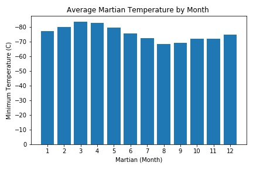
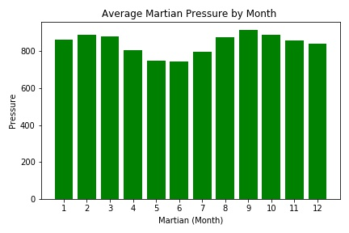
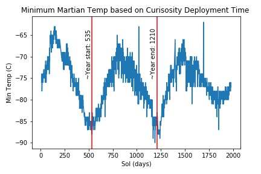

# data_collection_challenge
data_collection_challenge is an exercise to practice web data scraping techniques and data visualization using python. 

To practice these skills, the script aims to collect titles and article summaries from a mock website about mars. The script also scraps mars climate data from a table on the mock website. The data is then analyized and visualized.

### Part 1 - Mars News - part_1_mars_news.ipynb
---
Selenium and BeautifulSoup are used to scrap titles and preview text from the homepage of a mars website and stores them as mars_text.json in the Resources folder.

### Part 2 - Mars Weather - part_2_mars_weather_ipynb
---
Selenium and BeautifulSoup are used to scrap data from a table of climate information on the mock mars website. The data is cleaned and used to answer five questions:
1. How many months exist on Mars?
2. How many Martian (and not Earth) days worth of data exist in the scraped dataset?
3. What are the coldest and the warmest months on Mars (at the location of Curiosity)? 
4. Which months have the lowest and the highest atmospheric pressure on Mars?
5. About how many terrestrial (Earth) days exist in a Martian year?

Answers:
1. 12 months exist on Mars.
2. There are 1867 days worth of data.
3. The coldest month was the third month, while the warmest month was the 8th month.

</img>

4. The highest pressure occured during the 9th month, and the lowest pressure occued during the 6th month.

</img>

5. Based on a visual estimation, one mars year is about 675 earth days.

</img>

All data is stored in the Resources folder as mars_temp_pressure.csv

---
Script was made for UCB Data Analytics Challenge 11

Author - Jacob Pohs

Some code written by provided 'starter_code'